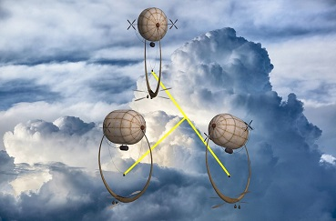

[](https://badge.fury.io/js/beamlambda)
[](https://opensource.org/licenses/GPL-3.0)
# Aerostat Beam Lambda

[Node.js](https://nodejs.org/) native bindings to [FFmpeg](https://www.ffmpeg.org/) for [AWS Lambda](https://aws.amazon.com/lambda/) [layers](https://docs.aws.amazon.com/lambda/latest/dg/configuration-layers.html) with support for asynchronous processing via streams and promises.

The purpose of this package is to facilitate access to the capabilities of FFmpeg - including media muxing, demuxing, encoding, decoding and filtering - from AWS Lambda functions written in Node.js. Rather than using the filesystem and controlling the FFmpeg as an external command line process, the beam coder executes functions of the FFmpeg _libav*_ libraries directly. Work is configured with Javascript objects and jobs execute over data buffers that are shared between Javascript and C. Long running media processing operations are asynchronous, running as promises that execute native code on a separate thread from the main event loop.

This package provides a lambda layer that can be included in your serverless lambda functions. To do this, follow the installation instructions below and require the `beamlambda` module. Then use the package as if it were a locally installed [`beamcoder`](https://www.npmjs.com/package/beamcoder) in combination with AWS and other libraries.

### Example

__TODO__ - create an intriguing beam lambda example

### Aerostat

Beam lambda is part of Streampunk Media's [_Aerostat_](https://en.wikipedia.org/wiki/Aerostat) open-source product set, whereby a conceptual fleet of media-oriented _aerostats_ (_blimps_, _air ships_, _zeppelins_ etc.) are launched into the clouds. Media content is beamed between the fleet as if light beams, and beamed to and from locations on the planet surface as required. See also the [_Aerostat Beam Engine_](https://www.npmjs.com/package/beamengine).

## Installation

[](https://www.npmjs.com/package/beamlambda)

### AWS layer

Beam lambda uses features of Node.js only available from version 8 onwards, so the compatible runtime for a lambda function must be set to `nodejs8.10` or later (when available).

Add one of the following generally accessible layers to your lambda function by ARN, based on the AWS region.

| region                       | layer arn                                                       |
| ---------------------------- | --------------------------------------------------------------- |
| `ap-south-1` (Mumbai)        | `arn:aws:lambda:ap-south-1:258641003975:layer:beamlambda:1`     |
| `ap-northeast-2` (Seoul)     | `arn:aws:lambda:ap-northeast-2:258641003975:layer:beamlambda:1` |
| `ap-southeast-1` (Singapore) | `arn:aws:lambda:ap-southeast-1:258641003975:layer:beamlambda:1` |
| `ap-southeast-2` (Sydney)    | `arn:aws:lambda:ap-southeast-2:258641003975:layer:beamlambda:1` |
| `ap-northeast-1` (Tokyo)     | `arn:aws:lambda:ap-northeast-1:258641003975:layer:beamlambda:1` |
| `ca-central-1` (Canada)      | `arn:aws:lambda:ca-central-1:258641003975:layer:beamlambda:1`   |
| `eu-central-1` (Frankfurt)   | `arn:aws:lambda:eu-central-1:258641003975:layer:beamlambda:1`   |
| `eu-west-1` (Ireland)        | `arn:aws:lambda:eu-west-1:258641003975:layer:beamlambda:4`      |
| `eu-west-2` (London)         | `arn:aws:lambda:eu-west-2:258641003975:layer:beamlambda:1`      |
| `eu-west-3` (Paris)          | `arn:aws:lambda:eu-west-3:258641003975:layer:beamlambda:1`      |
| `eu-north-1` (Stockholm)     | `arn:aws:lambda:eu-north-1:258641003975:layer:beamlambda:1`     |
| `sa-east-1` (Sao Paulo)      | `arn:aws:lambda:sa-east-1:258641003975:layer:beamlambda:1`      |
| `us-east-1` (N. Virginia)    | `arn:aws:lambda:us-east-1:258641003975:layer:beamlambda:1`      |
| `us-east-2` (Ohio)           | `arn:aws:lambda:us-east-2:258641003975:layer:beamlambda:1`      |
| `us-west-1` (N. California)  | `arn:aws:lambda:us-west-1:258641003975:layer:beamlambda:1`      |
| `us-west-2` (Oregon)         | `arn:aws:lambda:us-west-2:258641003975:layer:beamlambda:1`      |

Use beam lambda in your function by requiring the module from the layer:

```javascript
const AWS = require('aws-sdk');
const beamcoder = require('beamlambda');
exports.handler = async (event) => { // Available for Node.js 8 onwards
  // Do something involving the beam coder here, possibly asynchronously
};
```    

### Local installation - linux only

Beam lambda can be installed on Linux and make use of the self-contained FFmpeg libraries without needing to install FFmpeg development resources. Ensure that your systems has Node.js v10 LTS or later installed and has build tools set up as described for [`node-gyp`](https://github.com/nodejs/node-gyp). Then install `beamlambda` in your project and require it in your Javascript code.

    npm install beamlambda

    const beamcoder = require('beamlambda');

## License

This project is licensed under the GNU General Public License, version 3 or later. Copyright (C) 2019, Streampunk Media Ltd.

This software links to libraries from the FFmpeg project, including optional parts and optimizations covered by the GPL v2.0 or later. Your attention is drawn to the FFmpeg project's page [FFmpeg License and Legal Considerations](https://www.ffmpeg.org/legal.html) and the Copyright notices of the FFmpeg developers.

This project is in no way part of or affiliated with the FFmpeg project.

### Acknowledgements

A massive thank you to the FFmpeg development team who's tireless and ongoing work make this project - and so many other media software projects - possible.
